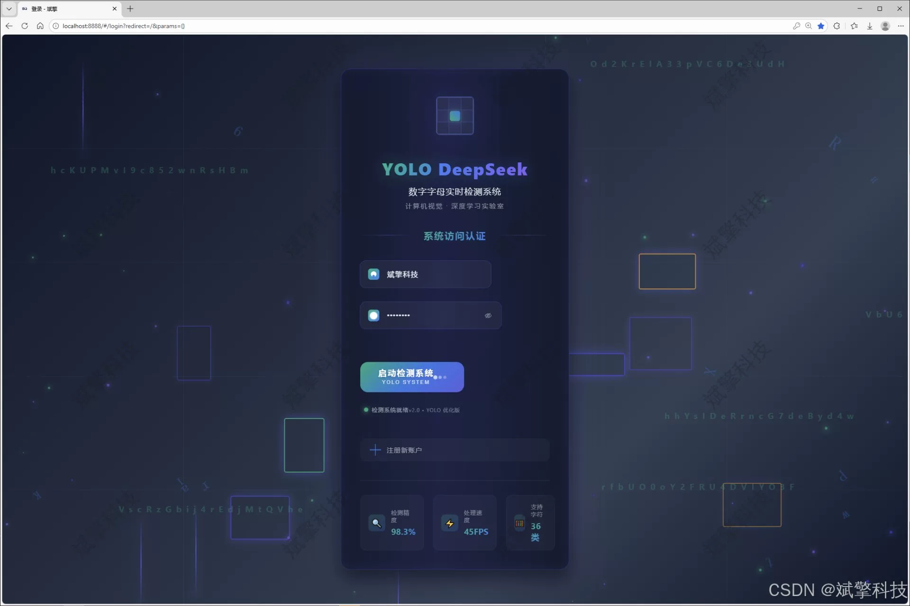
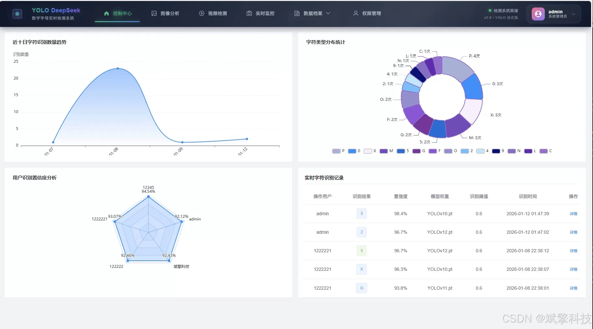
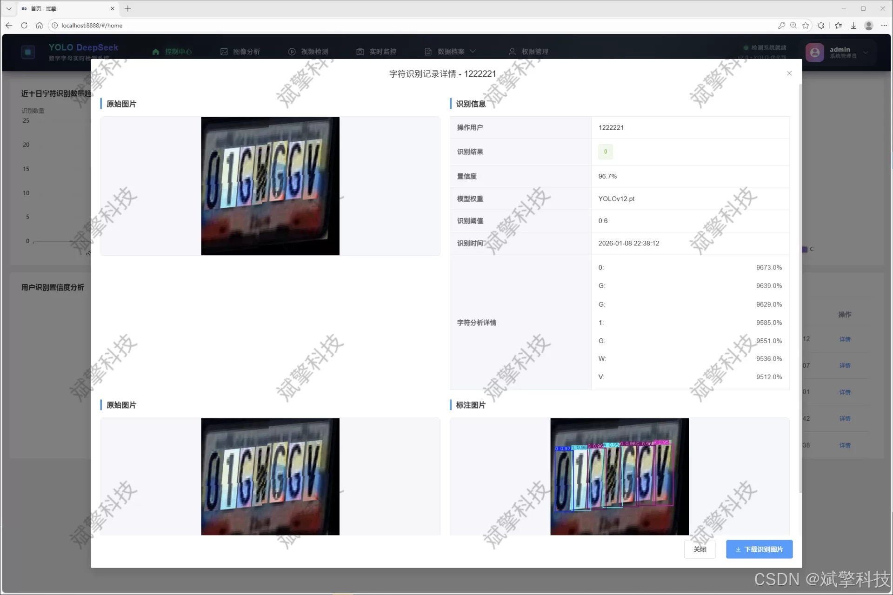
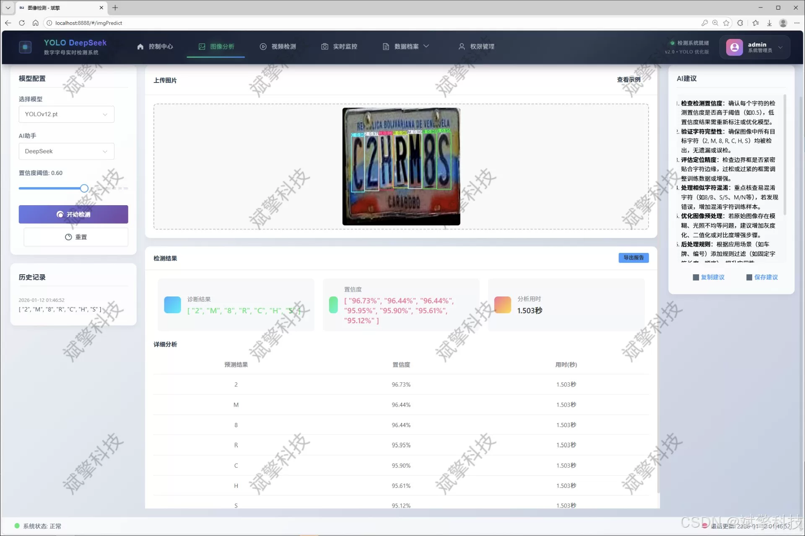
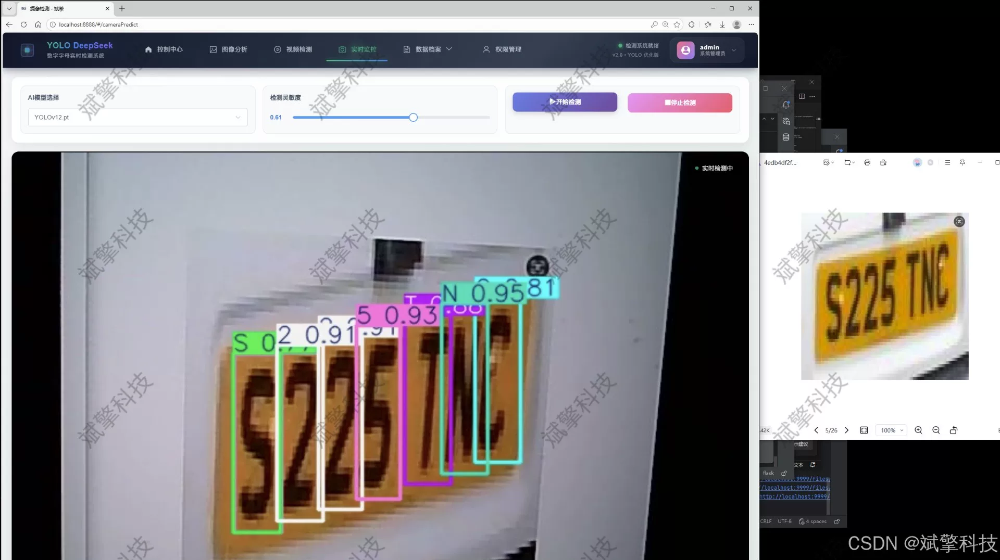
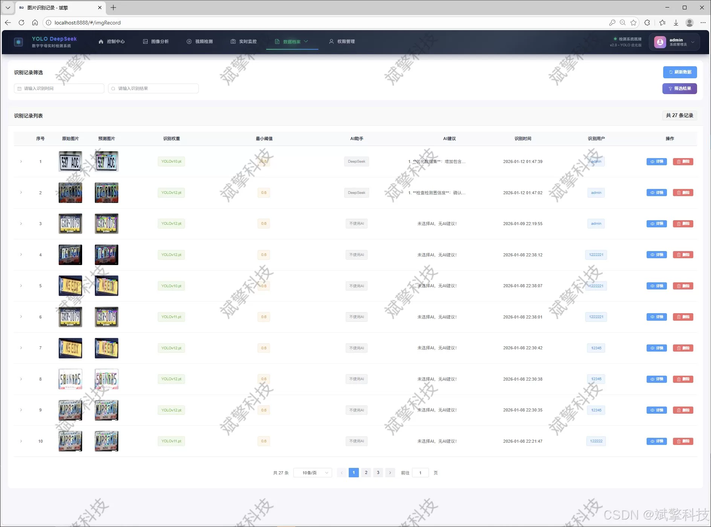
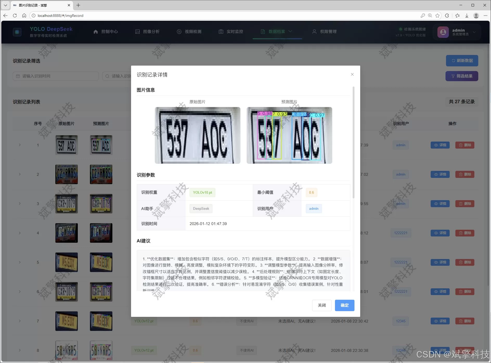
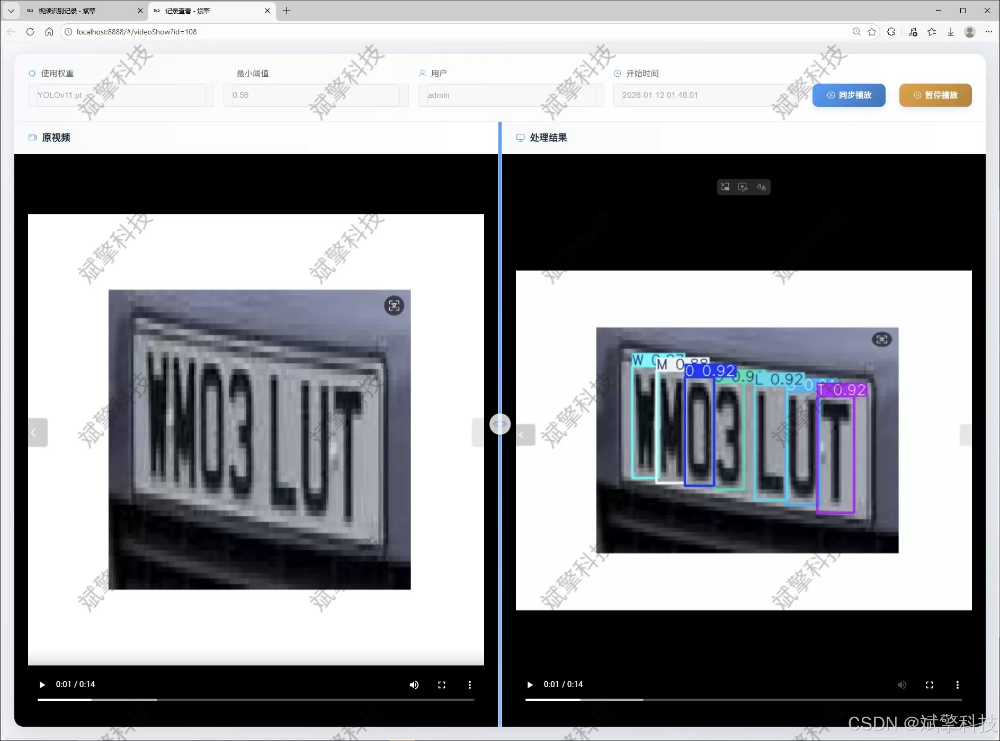
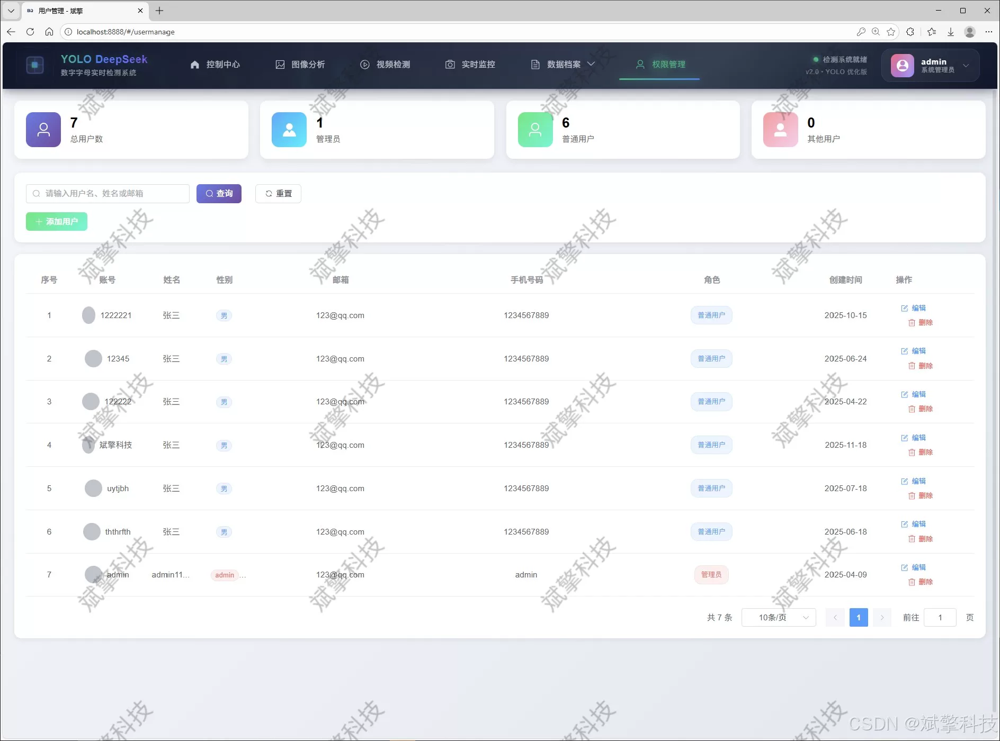

# YOLO Letter and Number Recognition

## Body

YOLO Letter and Number Recognition Based on YOLO Deep Learning and the Large Models of Qianwen, DeepSeek for Letter and Number Recognition Detection System (DeepSeek Intelligent Analysis + web interaction interface + front-end and back-end separation + YOLO data + YOLOv8/YOLOv10/YOLOv11/YOLOv12)

The project design and implementation of an intelligent letter and digit recognition and detection system that integrates cutting-edge object detection technology with modern Web development frameworks. The core of the system adopts the latest and high-performance version of the YOLO series (including YOLOv8, YOLOv10, YOLOv11, and YOLOv12), building a robust multi-character recognition model aimed at achieving rapid and accurate recognition of 36 types of targets in images, video streams, and real-time camera views, including letters (A-Z) and numbers (0-9).

To provide a friendly, efficient, and feature-rich interaction platform, this system adopts a front-end-backend separation architecture. The backend is built on the SpringBoot framework, responsible for model reasoning, business logic processing, and data persistence, using MySQL to systematically store user information, detection records, and results. The frontend uses modern web technologies to construct a responsive interactive interface, supporting user login and registration, dynamic model switching, multimedia file upload detection, and real-time camera capture. One of the core features of the system is the integration of DeepSeek intelligent analysis function, which can further perform semantic analysis and interpretation on detection results, enhancing the application depth of the system.

Furthermore, the system has also built a complete management function module, including recognition record classification (images, videos, cameras), user personal information maintenance and system user management led by administrators. Through data visualization technology, the system intuitively presents key information such as model performance indicators and recognition statistics, assisting users in decision-making analysis. This system integrates artificial intelligence, software engineering, and database technology, not only verifying the effectiveness of YOLO series models in real scenarios, but also providing a scalable and easy-to-maintain complete solution for character recognition applications, with high practical value and academic research significance.

Functional module

✅ User Login and Registration: Supports password detection, saves to MySQL database.

✅ Supports four YOLO model switches, YOLOv8, YOLOv10, YOLOv11, YOLOv12.

✅ Information Visualization, Data Visualization.

✅ Image detection supports AI analysis functions, deepseek and Qianwen.

✅ Supports image detection, video detection, and real-time camera detection. The results are saved to a MySQL database.

✅ Picture recognition record management, video recognition record management and camera recognition record management.

✅ User Management Module, administrators can add, delete, modify, and query users.

✅ Personal center, can modify their own information, password name profile picture and so on.

There is no Lunwen writing service, nor any Lunwen.

## Images

## Payment

Here is a pay link on Stripe ( https://buy.stripe.com/3cs8yP7sY87d0vu9AB ). Please contact me lonlonago@foxmail.com after funding $89, and I will send you a complete data files , thank you!

